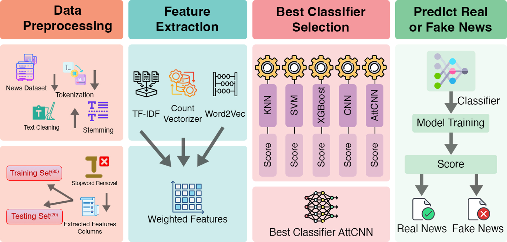

# Unveiling Fake News with an Attention-Based CNN Model Using Hybrid Features

This paper implements an Attention-based Convolutional Neural Network (AttCNN) model for detecting fake news. The model utilizes a hybrid feature extraction approach that combines CountVectorizer (CV), TF-IDF, and Word2Vec to enhance prediction performance.

## Background

With the rise of social media and online platforms, the spread of fake news has become a significant concern. This paper aims to develop a robust model to accurately detect and classify fake news articles.

## Datasets

The model is trained and tested on a [kaggle dataset](https://www.kaggle.com/c/fake-news/data?select=train.csv) of news articles labeled as either real or fake. The dataset includes various features such as id, title, author, text, and label.

## Methodology & WorkFlow

1. **Data Preprocessing**: Cleaning and preparing the text data for analysis.
2. **Feature Extraction**: Utilizing CountVectorizer, TF-IDF, and Word2Vec to extract relevant features from the text.
3. **Model Training**: Training the AttCNN model on the extracted features.
4. **Evaluation**: Assessing the model's performance using various metrics.

## Model Architecture

The architecture of the AttCNN model consists of:

-   **Embedding Layer**: For transforming input text into dense vectors.
-   **Convolutional Layers**: To capture local patterns in the text data.
-   **Attention Mechanism**: Enhances important features while suppressing less relevant ones.
-   **Fully Connected Layers**: For classification of the output.

## Performance Evaluation

The performance of the AttCNN model is evaluated using several metrics, including:

-   **Accuracy (ACC)**
-   **Precision (Pre)**
-   **Recall (Sen)**
-   **F1 Score (F1)**
-   **Area Under the Curve (AUC)**

## Results

The AttCNN model shows promising results compared to traditional machine learning classifiers and existing state-of-the-art methods. The following tables summarize the performance of the model:

### 1. Performance Comparison of AttCNN with Different Feature Sets

| Features             | AUC    | ACC    | MCC    | Sen    | Spe    | Pre    | F1     |
| -------------------- | ------ | ------ | ------ | ------ | ------ | ------ | ------ |
| TF-IDF               | 0.9973 | 0.9839 | 0.9678 | 0.9842 | 0.9836 | 0.9828 | 0.9835 |
| CountVectorizer (CV) | 0.9980 | 0.9887 | 0.9774 | 0.9911 | 0.9864 | 0.9858 | 0.9884 |
| Word2Vec (W2V)       | 0.9864 | 0.9579 | 0.9177 | 0.9887 | 0.9287 | 0.9295 | 0.9582 |
| CV + TF-IDF + W2V    | 0.9990 | 0.9909 | 0.9817 | 0.9941 | 0.9878 | 0.9873 | 0.9907 |
| CV + TF-IDF          | 0.9981 | 0.9889 | 0.9779 | 0.9896 | 0.9883 | 0.9877 | 0.9887 |
| TF-IDF + W2V         | 0.9972 | 0.9577 | 0.9183 | 0.9970 | 0.9203 | 0.9224 | 0.9583 |
| CV + W2V             | 0.9989 | 0.9911 | 0.9822 | 0.9926 | 0.9897 | 0.9892 | 0.9909 |

### 2. Comparison of AttCNN with Conventional ML Classifiers

| Feature | Classifier | AUC    | ACC    | MCC    | Sen    | Spe    | Pre    | F1     |
| ------- | ---------- | ------ | ------ | ------ | ------ | ------ | ------ | ------ |
| TF-IDF  | KNN        | 0.6341 | 0.5351 | 0.2169 | 0.9995 | 0.0933 | 0.5119 | 0.6770 |
|         | SVM        | 0.9982 | 0.9861 | 0.9723 | 0.9945 | 0.9778 | 0.9777 | 0.9861 |
|         | XGBoost    | 0.9960 | 0.9865 | 0.9732 | 0.9951 | 0.9784 | 0.9777 | 0.9863 |
|         | CNN        | 0.9987 | 0.9849 | 0.9699 | 0.9822 | 0.9876 | 0.9873 | 0.9848 |
| AttCNN  |            | 0.9973 | 0.9839 | 0.9678 | 0.9842 | 0.9836 | 0.9828 | 0.9835 |
| CV      | KNN        | 0.8958 | 0.8288 | 0.6998 | 0.9956 | 0.6703 | 0.7417 | 0.8501 |
|         | SVM        | 0.9982 | 0.9861 | 0.9723 | 0.9945 | 0.9778 | 0.9777 | 0.9861 |
|         | XGBoost    | 0.9962 | 0.9882 | 0.9765 | 0.9951 | 0.9817 | 0.9810 | 0.9880 |
|         | CNN        | 0.9985 | 0.9883 | 0.9767 | 0.9910 | 0.9856 | 0.9859 | 0.9884 |
| AttCNN  |            | 0.9980 | 0.9887 | 0.9774 | 0.9911 | 0.9864 | 0.9858 | 0.9884 |
| W2V     | KNN        | 0.9603 | 0.9159 | 0.8323 | 0.9320 | 0.9006 | 0.8991 | 0.9153 |
|         | SVM        | 0.9621 | 0.9022 | 0.8054 | 0.9240 | 0.8809 | 0.8840 | 0.9035 |
|         | XGBoost    | 0.9842 | 0.9406 | 0.8817 | 0.9551 | 0.9268 | 0.9255 | 0.9401 |
|         | CNN        | 0.9836 | 0.9298 | 0.8666 | 0.9926 | 0.8682 | 0.8809 | 0.9334 |
| AttCNN  |            | 0.9864 | 0.9579 | 0.9177 | 0.9887 | 0.9287 | 0.9295 | 0.9582 |

### 3. Comparing AttCNN with Existing State-of-the-Art Methods

| Model                           | F1 Score | Accuracy | Precision | Recall |
| ------------------------------- | -------- | -------- | --------- | ------ |
| Naïve Bayes                     | 0.7283   | 0.7589   | 0.8293    | 0.6492 |
| Random Forest                   | 0.8329   | 0.8437   | 0.8362    | 0.8296 |
| Non-memory-based ensemble model | 0.8531   | 0.8639   | 0.8837    | 0.8246 |
| NN with Keras                   | 0.8579   | 0.8674   | 0.8637    | 0.8522 |
| Memory-based ensemble model     | 0.8645   | 0.8730   | 0.8617    | 0.8672 |
| Decision Tree                   | 0.8924   | 0.8992   | 0.8610    | 0.9262 |
| LSTM                            | 0.8930   | 0.9015   | 0.9278    | 0.8607 |
| SVM                             | 0.8945   | 0.9028   | 0.9222    | 0.8670 |
| AttCNN (Proposed Model)         | 0.9907   | 0.9909   | 0.9906    | 0.9909 |

## Conclusion

The proposed AttCNN model demonstrates superior performance in detecting fake news compared to traditional machine learning classifiers and existing state-of-the-art methods. The hybrid feature extraction approach combining CV, TF-IDF, and Word2Vec significantly enhances the model's predictive capabilities. The attention mechanism further improves the model's interpretability and feature selection, making it a robust solution for fake news detection.
